# Continuous Deployment for Testnets following GitOps

Continuous Deployment (CD) are a set of practices aimed at increasing the security, efficiency and overall reliability of the deployment process by introducing GitOps automation. These can be adopted in the deployment process of Mina testnets, enabling enhanced accountability, reliable deployments, and configuration drift prevention.

## Summary

Declarative models are particularly useful when managing Infrastructure as Code (IaC) and Kubernetes deployments, mainly because these are used to describe a ***desired state***.

By leveraging Git as the single source of truth holding the desired state of infrastructures or deployments, a great deal of automation may be built around events to such state. This is essentially what the GitOps practices proposes:
- Git as single source of truth
- Tooling (i.e., **GitOps Operator**) able to monitor/react to changes to the source of truth and apply them on a destination infrastructure (e.g., GCP, GKE, Kubernetes, etc.)
- Keep the current state of the deployment in line with the desired state (i.e., configuration drift prevention).

In a Software Development Life Cycle (SDLC) a GitOps Continuous Integration (CI) workflow can be generalized in the following pipeline:

```text
┌──────────┐      ┌────────┐      ┌──────────────────────────┐
│ 1. Build │ ---> │ 2. Test│ ---> │ 3. Container image Push  │──┐
└──────────┘      └────────┘      └──────────────────────────┘  │
 ┌--------------------------------------------------------------┘
 │   ┌──────────────────────────┐      ┌─────────────────────┐
 └-> │ 4. Git clone config repo │ ---> │ 5. Update manifests │──┐
     └──────────────────────────┘      └─────────────────────┘  │
 ┌--------------------------------------------------------------┘
 │     ┌────────────────────────┐
 └---> │ 6. Git commit and push │
       └────────────────────────┘
```

Where: 
1. A container image is **built**. This generally includes unit testing and code smell analysis.
2. Functional tests continue.
3. Once testing phase is cleared, the image is pushed to a repository with an specific version tag.
4. The deployment configurations repository is fetched as to
5. update deployment manifests with new version tag.
6. The change is pushed to the deployment configuration repository.

Steps `[4-5]` are key to a GitOps Continuous Deployment workflow. In the example, the referenced `config repo` represents the desired state of a particular deployment. Therefore, a CD workflow will be triggered by such change:

```text
┌──────────────────────────┐      ┌───────────────────────┐    
│ 7. Git clone config repo │ ---> │ 8. Discover manifests │ ─┐
└──────────────────────────┘      └───────────────────────┘  │
┌------------------------------------------------------------┘
│   ┌───────────────────┐
└-> │ 9. kubectl apply  │
    └───────────────────┘
```
This latter workflow reflects the actions taken by the GitOps Operator, these are:

7. Cloning `config repo` upon changes.
8. Discover changes to monitored manifests.
9. Apply new configuration so current state matches desired state.


The overall architecture proposed by this model is shown below:
<!--  -->
```text
┌----------------------┐      ┌------------┐       ┌--------------------┐
│ Platform Engineering │ <--> │ GitOps     │ <-->  │ Infrastructure/    │
│ Team                 │      │ Operator   │       │ Deployments        │
└----------------------┘      │    ____    │       │       .--.         │
                              │   /    \   │       │    .-(    ).       │
                              │  (  oo  )  │       │   (___.__)__)      │
                              │   \____/   │       └--------------------┘
                              └------------┘
                                    ^
                                    │
                                    │
                              ┌------------┐
                              │            │
                              │     GIT    │
                              │            │
                              └------------┘
                                    ^
┌----------------------┐            │           ┌----------------┐
│ Development Team     │ -----------┘-----------│ Other Teams    │
└----------------------┘            │           └----------------┘
                                    │
┌----------------------┐            │
│ QA Team              │ -----------┘
└----------------------┘
```

## Motivation

This architecture proposes the following features:
- GitOps Operator deals with the deployment, configuration drift protection and rollback tasks.
- Enables Teams to create, review and/or make changes to deployments without need to understand the underlying procedures.
  - Changes are reviewed and approved by authorized parties via Git-native mechanisms, such as pull-requests.
  - Baked into the process is increased accountability or transparency. Anyone may review and understand reasoning of changes by reading commit messages and participating on pull-requests discussions.
  - Authorized parties then trigger deployment actions by merging commits to corresponding branches.
- Infrastructure access is secured as only GitOps Operator may perform changes.

All in all, the proposed architecture/workflow ensures that Platform Engineering focuses on developing and maintaining infrastructure tools. Consequently, such tools empower development teams to change the system's desired state via Git, supported by a review process in which cross-collaboration is possible and transparency is built-in.

## Objective
Implement a GitOps-based Continuous Deployment PoC for testnets.

### Detailed objectives

#### 1. Design and develop a Generic GitOps CD PoC
This will involve the deployment of a GitOps CD workflow. Relevantly, it should take into consideration the management and operation of Secrets and how these would be injected securely into Helm Charts before deployment. Further, it should include a GitOps Operator able to achieve the features proposed by the architecture.

#### 2. Adapt workflow to include Charts' external requirements
Currently, deployments retrieve data from secured vaults (e.g., in GCP) in order to pre-configure the deployment's namespace with all required Secrets. This task will detail such requirements and adapt the workflow design as to satisfy them.

#### 3. Deploy a Testnet following a GitOps CD workflow
Attempt a deployment of a sample dummy testnet leveraging the designed workflow.

## 1. Generic GitOps CD PoC



