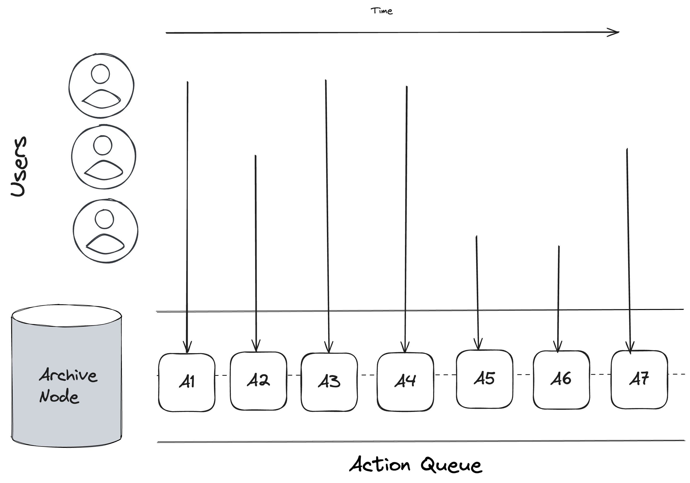
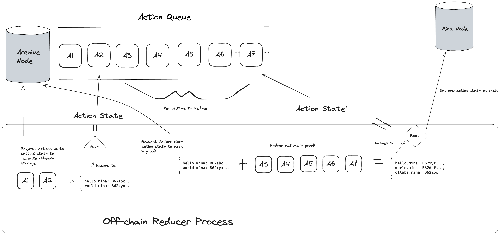

# Offchain State API RFC: Name Service zkApp (DRAFT)
## Summary

The Exploration team at O1 Labs has a mandate to develop expertise in the o1js SDK and disseminate that knowledge through the user bases of our developer community and partners.  This RFC outlines an approach to build an app using the new Offchain State API, with the goals of providing a reference implementation of the feature, identifying blockers, pitfalls, and opportunities to improve developer experience, and inspiring the community to experiment on their own with offchain state.


## Motivation

Please see [RFC](https://www.notion.so/o1labs/Concurrent-State-Updates-Example-zkApp-4c557ef2724b401e83f58193d4fb2a84) for additional details.

We have identified concurrent updates to application state as a challenge that many zk app developers struggle to overcome.  The off-chain state API is a solution developed by O1 Labs to address the problem, but since its release, we have received questions about usage and have yet to see widespread adoption.  Building a sample app will give developers more confidence about the correct usage of the API, as well as develop our internal expertise about the feature, which will lead to better community support.

The app we decided to build is a namespace resolver.  This is an excellent example for a few reasons:
It is a well-known use case in the community.  The success of ENS means that most developers will have an intuitive understanding of the functional requirements for a namespace resolver and can spend their time understanding the implementation rather than the product spec.
It avoids ethical and legal gray areas as well as excessive financial risk.
Outside of the direct need for off-chain state, the app's functionality is simple, thus highlighting only the specific feature we intend to show off.


## Detailed design

Offchain State API offers `OffchainState.Map`, which can store key-value pairs and `OffchainState.Field`, which can store a Field or any other type of data that can be represented as a Field. This design utilises `OffchainState.Map` to store domain to record mapping and `OffchainState.Field` to store the premium for registering a domain.

### Data Types

```ts
class NameRecord extends Struct({
    owner: PublicKey,
    data: ...
}) {}

class Name extends PackedString() {}

const offchainState = OffchainState({
    nameRecords: OffchainState.Map(Name, NameRecord),
});
```

### Actions

#### Schema

The offchain storage API includes helper functions to get, overwrite, and update state.  Below are listed the emitted events, and their associated functions in the API.

- NameRegistrationEvent(name: Name)
  - overwrite(name, { owner: this.sender })
- RecordSetEvent(name: Name, record: NameRecord)
  - overwrite(name, record)
- NameRegistrationTransferEvent(name: Name, from: PublicKey, to: PublicKey)
  - update(name, { owner: to }, precondition: { owner: from })

The following events are associate with on-chain state, and do not generate actions to reduce.

- PremiumChangedEvent(newPremium: UInt64)
- PauseToggleEvent
- AdminChangeEvent(newAdmin: PublicKey)


#### Storage

The offchain state actions will be emitted by users submitting proofs to Mina, and will be queued up for later reduction on an archive node.  Order is guaranteed to be the same on every archive node, but it is not guaranteed to be stored in the same order in which the proofs were submitted.



### Reducer

The reducer of offchain state reads actions off of the archive node, rolls them up into a final state, and submits proof of that state to Mina.

> [!WARNING] 
> By default, a reducer process must rebuild state from scratch by processing the actions up to the current action hash.  This process scales linearly with usage, and is succeptible to DDOS attack.  A skilled reducer will store snapshots of past data to skip replaying all actions from history, but this is a centralizing influence on a zkapp.  The default behavior of replaying all actions for every reduction is not suitable for produciton.

> [!WARNING]
> This pattern relies on an archive node being available to provide data availability for free.  This is also not suitable for production.



### Smart Contract
##### Off-chain State
```ts 
names: OffchainState.Map(Name, NameRecord) // ownership records of names
```

#### On-chain State
```ts
premium: UInt64 // price in Mina to register a new name record
isPaused: Bool // whether or not new actions may be generated by this smart contract
admin: PublicKey // public key with rights to pause this smart contract
```

#### User Facing Methods
##### Register name
```ts
/** 
 * Sender transfers {this.premium} to the contract and sets themselves as the owner of the name in the state
 * Fails if
 *   - sender cannot afford premium
 *   - name is already owned
 *   - name does not meet criteria
 * 
 * @emits NameRegistrationEvent
 */
@method async register_name(name: Name)
```
##### Set record
```ts
/**
 * Sets the domain record for a given name
 * Fails if
 *   - the name is not owned by sender
 * 
 * @emits RecordSetEvent
 */
@method async set_record(name: Name, record: NameRecord)
```
##### Transfer ownership
```ts
/**
 * Transfer ownerhsip of a name record to a new PublicKey
 * Fails if
 *   - the name is not owned by sender
 * 
 * @emits NameRegistrationTransferEvent
 */
@method async transfer_name_ownership(name: Name, new_owner: PublicKey)
```
##### Owner of
```ts
/**
 * @returns owner of given name
 */
@method.returns(PublicKey) async owner_of(name: Name): PublicKey
```
##### Resolve
```ts
/**
 * @returns full record associated with given name
 */
@method.returns(NameRecord) async resolve_name(name: Name): NameRecord
```
##### Premium rate
```ts
/**
 * @returns the current premium required to register a new name
 */
@method.returns(UInt64) async premium_rate(): UInt64
```
##### Get admin
```ts
/**
 * @returns the public key of the admin
 */
@method.returns(PublicKey) async get_admin(): PublicKey
```
##### Is Paused
```ts
/**
 * @returns true if the contract is currently paused, false otherwise
 */
@method.returns(Bool) async is_paused(): Bool
```


#### Admin Functions

##### Set premium rate
```ts
/**
 * Set the premium required to register a new name
 * Only admin
 * 
 * @emits PremiumChangedEvent
 */
@method async set_premium(new_premimum: UInt64)
```
##### Toggle Pause 
```ts
/**
 * Change the pause state of the smart contract, pausing it if currently unpaused or unpausing it if currently paused
 * Only admin
 * 
 * @emits PauseToggleEvent
 */
@method async toggle_pause()
```
##### Change admin
```ts
/**
 * Set a new admin
 * Only admin
 * 
 * @emits AdminChangeEvent
 */
@method async change_admin(new_admin: PublicKey)
```

## Test plan and functional requirements

### Functional Requirements

The following functional requirements should be covered by unit testing

- Deployment
  - The smart contract can be deployed
- Admin Functions
  - The admin can set a premium
  - The admin can pause the smart contract
  - The admin can unpause the smart contract
  - The admin can set a new admin
- User Functions
  - A user can register a name
    - They must transfer {@premium} Mina to the smart contract
    - An action will be emitted setting their ownership of the name off chain
> [!WARNING]
> 2 users could each register the same name.  Both payments will be processed, but only one user will end up owning the name.  Further thought is needed to resolve this issue.
  - A user can set a record for a name they own
    - An action will be emitted setting the record off chain
  - A user can transfer ownership of a name to another user
    - An action will be emitted updating the record off chain
  - A user can see who owns a given name
  - A user can see a record associated with a given name
- Reducer Functions
  - A reducer can process...
    - NameRegistrationEvents
    - RecordSetEvents
    - NameRegistrationTransferEvents
  - A reducer can update the action hash of the smart contract after processing a batch of actions

### Non Functional Requirements

The system should meet the following non functional requirements in order to serve the needs of users.

- It is possible to run a reducer with no authorization or credentials
- The system is eventually consistent, and can always reach the latest-emitted action
- The time complexity to reduce actions should be constant with respect to historical number of events emitted
  - Events 0-100 should take about as long as events 1,000,000-1,000,100
- Assuming input of 100 actions per block...
  - Latency to completion is <= 3 blocks
  - Average action queue is <= 200 actions
  - throughput is 100 actions per block

## Drawbacks

- The offchain state API requires high latency
- The system is suceptible to DDOS attack
- Archive nodes are not properly incentivized to serve these requests
- Separate development is needed to efficiently run a reducer

## Rationale and alternatives

There are two dominant alternatives available to zkApp builders.

Protokit is an app-chain development SDK that can also solve the storage and concurrency problems that the off-chain storage API solves.  As of now, protokit chains cannot settle to Mina, so it will not work for zkApp developers looking to go live on main net today.

Developers can also implement a custom solution to solve these problems using the primitives available in o1js already.  This solution requires expert knowledge and will not be as thouroughly reviewed as the official API from o1Labs.

We support competing implementations and see a place for both of these alternatives.  The o1js implementation offers a solution that's usable on main net today and accessible to developers who are already familiar with programming in o1js.


## Prior art

There is an existing domain name resolver zkApp that is built with a custom storage solution: https://names.minascan.io/ ([github](https://github.com/Staketab/mina-names)).  They seem to be using an NFT solution, which costs an account creation fee for each domain registered.  A solution using off-chain storage has the potential to be cheaper to operate, but the NFT solution does not have the same DDOS vulnerability.


## Unresolved questions

- How can we get reducers to use "snapshots" of already-processed state hashes to avoid the need to rebuild state from scratch?
- How can we prevent a bad actor from emitting infinite RecordSetEvents and DDOSing the system?
- What is the path forward for archive nodes to monetize actions DA?  Will this eventually be replaced by Celestia?  Do we need some indexing service to enter the space to support these types of apps?
- How can we refund a user if they attempt to buy a name, but by the time their action is processed, it is no longer available?